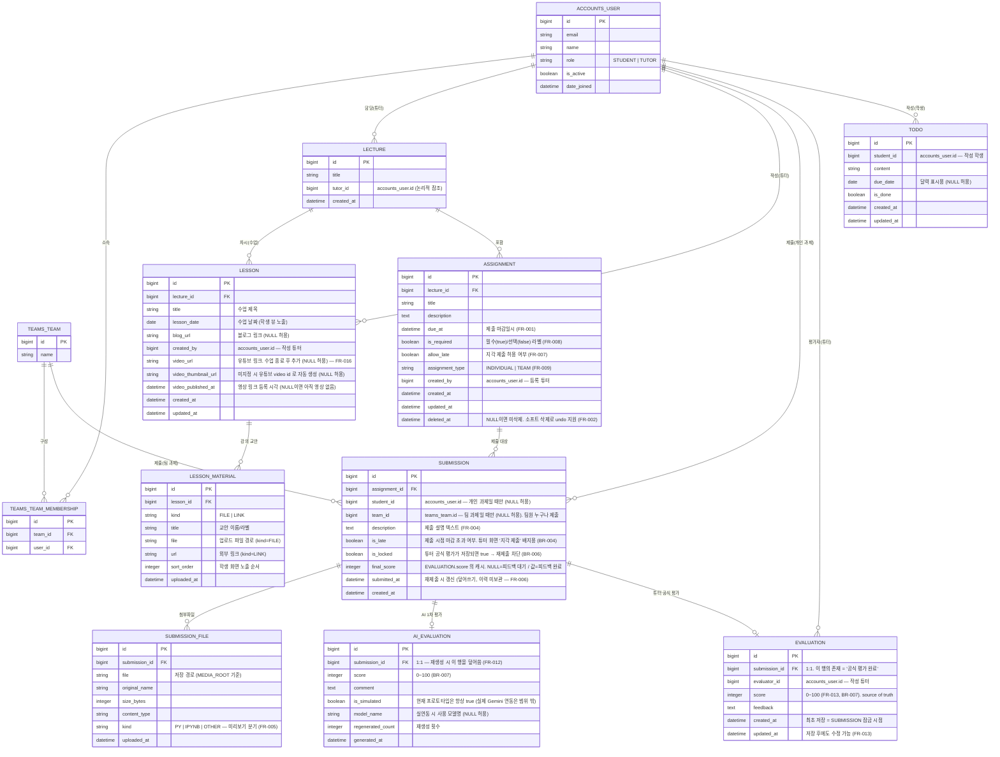

# 과제 제출 및 피드백 관리 시스템 — ERD (v6)

**기준 문서:** PRD v0.3 (2026-08-26) + 설계 논의 정리 (`과제시스템-설계논의-정리`)
**개정:** 2026-08-27

> **2026-08-27 추가 결정 (목업 검토 후)**
> - **팀장(대표자) 개념 폐기** — `teams_team_membership.is_representative` 요청 취소. 팀 과제는 팀원 누구나 팀을 대신해 제출(1행 덮어쓰기).
> - **최종 점수(`final_score`) 집계 방식은 오픈 퀘스천** — 현재는 `EVALUATION.score` 를 그대로 복사(§4). 목업의 "튜터 8 : AI 2" 가중 합산은 **폐기된 안**.
> - **AI 평가는 재생성 가능** (재생성 시 `AI_EVALUATION` 덮어씀, 이력 없음).

v5 → v6 변경 요약
- `AI_EVALUATION` / `EVALUATION` 테이블 분리 (AI 1차 평가 vs 튜터 공식 평가)
- `SUBMISSION.final_score` 캐시 컬럼 추가 (+ 동기화 규칙)
- `SUBMISSION` 제출 주체를 `student_id` **XOR** `team_id` 배타 구조로 정리
- `SUBMISSION.is_locked` 플래그 명시
- `TODO` 엔티티 추가 (학생 대시보드)
- 외부 팀 테이블명을 실제 스키마(`teams_team_membership`)에 맞춤
- v5의 `LECTURE`(강의자료, 계획단계) → `LESSON` / `LESSON_MATERIAL` 로 대체, `LECTURE` 이름은 "강의(과목) 자체"로 재사용

---

## 1. 개요

### 1.1 DB 구성 — 2개 DB

| DB | 소유 | 본 시스템에서 |
|---|---|---|
| **`default`** | 본 프로젝트 | 아래 `lms_*` 테이블을 실제 생성/마이그레이션 (`managed=True`) |
| **`accounts`** | 외부 팀 구성 시스템 **AX Evaluator** | `accounts_user` / `teams_team` / `teams_team_membership` 를 **읽기 전용 참조** (`managed=False`, 마이그레이션 생성 안 함) |

- 두 DB 사이 **DB 레벨 FK 없음.** 외부 사용자·팀은 `id`(정수)만 저장하고 `apps/accounts_client/services.py` 헬퍼로 조회.
- `config/routers.py` 의 `AccountsRouter` 가 `accounts_client` 앱 모델을 `accounts` DB 로 라우팅하고, 교차 관계(`allow_relation`)를 막는다.
- 우리 테이블은 혼동 방지를 위해 **`lms_` 접두어**를 권장한다. (AX Evaluator 에 이미 `reviews_submission` 등이 있어, 향후 통합 가능성을 감안하면 `lms_submission` 처럼 명확히 구분하는 편이 안전. Django `Meta.db_table` 로 지정)

### 1.2 단일 강의 전제 (BR-001)
`LECTURE` 는 시스템 내 1행만 존재한다. 그래도 `LESSON`·`ASSIGNMENT` 의 소속을 명시하기 위해 테이블로 유지.

---

## 2. ERD (Mermaid)

> `TEAMS_TEAM_MEMBERSHIP` 의 실제 컬럼은 AX Evaluator 스키마에 따름. 위는 참조에 필요한 최소 형태.

---

## 3. 엔티티 설명

### 3.1 외부 참조 (`accounts` DB · `managed=False` · `apps/accounts_client/`)

| 엔티티 | db_table | 설명 |
|---|---|---|
| `AccountsUser` | `accounts_user` | 학생·튜터 계정. 역할 `STUDENT` / `TUTOR` 둘 뿐 (조교 없음) |
| `TeamsTeam` | `teams_team` | 팀. 명단은 AX Evaluator 가 관리, 본 시스템은 참조만 |
| `TeamsTeamMembership` | `teams_team_membership` | 팀-학생 매핑. 팀 과제 제출 자격(팀원 여부) 확인용 — §5 |

### 3.2 본 프로젝트 (`default` DB · `managed=True` · `apps/core/`)

| 엔티티 | 설명 | 관련 FR/BR |
|---|---|---|
| `LECTURE` | 강의(과목) 자체. 단일 강의라 1행 | BR-001 |
| `LESSON` | 강의 1회차(수업). 튜터가 제목·수업날짜·블로그링크 + 교안을 올리고, 수업 종료 후 유튜브 링크 추가. 학생 뷰엔 제목/날짜/교안/블로그링크가 항상 보이고, 영상이 등록되면 썸네일 + 임베드 플레이어가 같은 화면에 노출 | FR-015, FR-016 |
| `LESSON_MATERIAL` | 회차별 교안(복수). 업로드 파일(`kind=FILE`) 또는 외부 링크(`kind=LINK`) | FR-015, FR-016 |
| `ASSIGNMENT` | 과제. 마감일·필수/선택·지각허용·개인/팀 속성. 삭제는 `deleted_at` 소프트 삭제로 undo | FR-001, FR-002, FR-007~009 |
| `SUBMISSION` | 제출물. `(assignment, 제출단위)` 당 **1행**. 재제출은 덮어쓰기(이력 미보관). `final_score` 캐시 보유 | FR-004, FR-006, BR-004, BR-006 |
| `SUBMISSION_FILE` | 제출 첨부파일(복수). `kind` 로 미리보기 방식 결정(.py/.ipynb 렌더링, 그 외 파일명·크기만) | FR-004, FR-005 |
| `AI_EVALUATION` | AI 1차 평가(점수+코멘트). 제출물당 1행, 재생성 시 갱신. 현재 시뮬레이션 | FR-012, BR-007~009 |
| `EVALUATION` | 튜터의 공식 평가(점수+피드백). 최초 저장 시 제출물 잠금, 이후 수정 가능. 점수의 source of truth | FR-013, BR-006~008 |
| `TODO` | 학생 개인 할 일 (대시보드 달력/TODO 위젯). 학생 전용이라 `apps/student/models.py` 로 빼도 무방 | PRD 7장 |

---

## 4. 채점 흐름과 `final_score` (논의정리 §1)

### 4.1 흐름
1. 튜터가 제출물 검토 화면에서 **"AI 채점" 버튼**을 누른다 (자동 실행 아님).
2. 버튼이 Gemini API 를 트리거 → 점수(0~100)+코멘트 생성 → `AI_EVALUATION` 저장 (재생성 시 이 행 덮어씀).
   *현재 프로토타입은 실제 호출 없이 `is_simulated=true` 로 시뮬레이션.*
3. 튜터가 AI 결과를 참고해 직접 점수+피드백 작성 → `EVALUATION` 저장.
4. **`EVALUATION` 저장/수정 시 `SUBMISSION.final_score`, `SUBMISSION.is_locked = true` 로 자동 동기화** (`apps/core/signals.py` 의 post_save — 사람이 두 곳에 입력하지 않음).

### 4.2 `final_score` 를 따로 두는 이유
- `EVALUATION` 존재 자체가 "공식 평가 완료"이지만, `final_score` 는 별도 목적의 **캐시**:
  - **외부 점수 산출 시스템 연동**: `SUBMISSION` 만 조회해도 점수를 바로 가져갈 수 있어야 함 (`EVALUATION` 조인 불필요).
  - **대시보드 조회 성능**: 제출 현황 목록에서 점수를 조인 없이 표시.
- `final_score IS NULL` → "피드백 대기", 값 있음 → "피드백 완료".

### 4.3 `final_score` 집계 방식 — 오픈 퀘스천 (2026-08-27)
- **현재 구현**: `final_score = EVALUATION.score` (튜터 점수 그대로 복사). source of truth 는 `EVALUATION.score`.
- **폐기된 안**: 목업에 있던 "튜터 8 : AI 2" 가중 합산 (`tutor*0.8 + ai*0.2`) — 채택 안 함.
- 최종 집계 방식(가중치/rubric 반영 등)은 팀 논의 대기. 정해지면 `signals.py` 의 계산부만 수정하면 됨 (스키마 변경 없음).

---

## 5. 팀 과제 제출 자격 (2026-08-27 결정)

- **팀장(대표자) 개념 폐기.** `teams_team_membership.is_representative` 추가 요청 취소, `TEAM_REPRESENTATIVE` 별도 테이블 안(구 v4)도 폐기.
- 팀 과제는 **해당 팀의 팀원이면 누구나** 팀을 대신해 제출할 수 있다. 제출은 `(assignment, team)` 당 1행이며 재제출은 덮어쓰기(FR-006).
- 제출 시점 검증: "요청 사용자가 `teams_team_membership` 상 해당 팀 소속인지"만 확인 (BR-005).
- 누가 제출했는지는 `SUBMISSION` 에 저장하지 않는다. 필요해지면 `submitted_by_id` 컬럼 추가.

---

## 6. 저장하지 않고 파생하는 값

| 화면 표시 | 계산 방법 |
|---|---|
| 학생별 과제 상태 (미제출 / 제출완료 / 평가완료) | `SUBMISSION` 존재 + `SUBMISSION.final_score` NULL 여부 (FR-003) |
| "평가 대기 중" | 마감됨 + `SUBMISSION` 있음 + `final_score IS NULL` (AC-005) |
| "제출 기록 없음" | 마감됨 + `SUBMISSION` 없음 (FR-014, AC-002) |
| 제출률 / 미제출자 명단 | 대상 학생·팀 목록(AX Evaluator) − 제출자 (FR-010) |
| 재제출 가능 여부 | `now < assignment.due_at` **AND** `submission.is_locked = false`. 단 지각 허용 과제는 마감 후에도 *최초 제출*은 가능(AC-003) |
| 제출물 이전/다음 이동 | 목록 정렬 순서 기준 인접 `SUBMISSION` (FR-011) |
| 강의 영상 공개 여부 | `LESSON.video_url IS NOT NULL` (FR-016) |
| 유튜브 썸네일 | `video_thumbnail_url` 없으면 영상 링크의 video id 로 `https://img.youtube.com/vi/<id>/hqdefault.jpg` |

---

## 7. 주요 제약 / 규칙

- **제출 주체 배타** (논의정리 §4): `student_id` 와 `team_id` 중 **정확히 하나만** non-null, 그리고 `assignment.assignment_type` 과 일치.
  - 백엔드 validation(친절한 에러 메시지) + DB `CHECK` 제약(최후 방어선) 둘 다 적용.
  - 프론트는 해당 안 되는 입력 칸을 숨김.
- **제출 유일성**
  - 개인 과제: `UNIQUE(assignment_id, student_id)`
  - 팀 과제: `UNIQUE(assignment_id, team_id)`
  - (Django 조건부 `UniqueConstraint` 2개)
- **팀 과제 제출 자격**: 제출 시점에 "요청 사용자가 해당 팀 소속(`teams_team_membership`)인지"만 확인 (BR-005, §5). 누가 제출했는지는 행에 저장 안 함.
- **점수 범위** (BR-007): `AI_EVALUATION.score`, `EVALUATION.score`, `SUBMISSION.final_score` 모두 `0 ≤ score ≤ 100` 권장 — *현재 모델 초안에는 미적용* (§8).
- **지각 배지** (BR-004): `is_late` 는 학생 화면 비노출, 튜터 화면만 "지각 제출" 배지.

---

## 8. 아직 안 정해진 것

- **`final_score` 집계 방식** → 현재는 튜터 점수 그대로 복사. 가중치/rubric 반영 여부 미정 (§4.3).
- **점수 0~100 범위 강제** → `CHECK`/validator 를 넣을지 미정. 현재 `apps/core/models.py` 초안엔 `help_text` 만.
- **채점 기준(rubric)** 세부 항목 → 정해지면 `EVALUATION` / `AI_EVALUATION` 에 항목별 컬럼 추가 여부 논의.
- **`ASSIGNMENT.weight_tier`** (HIGH/MID/LOW) → 필드만 존재. 실제 가중치 숫자 매핑·`GRADING_POLICY` 는 미정.
- **인증 방식** (PRD 9장) → `ACCOUNTS_USER` 를 Django 인증 사용자로 쓸지, 세션 매핑을 둘지.
- **과제 삭제 시 하위 데이터** → 현재 `ASSIGNMENT.deleted_at` 소프트 삭제만. `SUBMISSION`/`EVALUATION` 동반 처리 정책 필요.
- **AI 평가 자동 실행 / 공개 시점 분리** → 필요 시 `AI_EVALUATION` 에 `published_at` 등 추가.
- **강의 영상**: 유튜브 링크 임베드만인지(파일 업로드 없음), 교안 허용 확장자·용량, 시청 트래킹(`LESSON_VIEW`) 필요 여부 → 현재 미포함.
