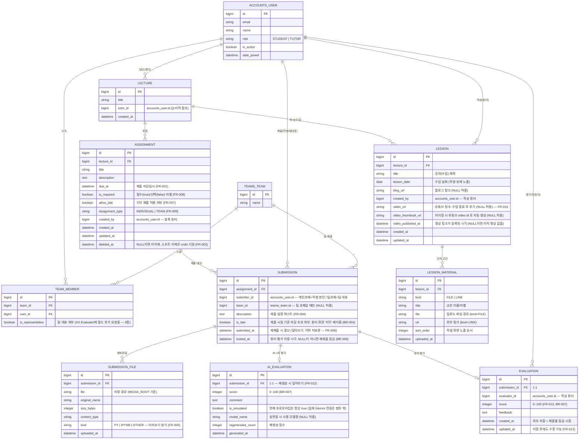

# 과제 제출 및 피드백 관리 시스템 — ERD

**기준 문서:** PRD v0.3 (2026-08-26)
**작성:** 2026-08-27

---

## 1. 개요

- DB 는 **PostgreSQL 2개**로 나뉜다.
  - **`default`** — 본 프로젝트 전용. 아래 `core` 앱 테이블이 실제로 생성/마이그레이션된다 (`managed=True`).
  - **`accounts`** — 외부 팀 구성 시스템(**AX Evaluator**) 소유. 본 시스템은 **읽기 전용 참조**만 한다 (`managed=False`, 마이그레이션 생성 안 함). → `apps/accounts_client/`
- 두 DB 사이에는 **DB 레벨 FK 를 걸지 않는다.** 외부 사용자·팀은 `id` 값(정수)만 저장하고, 필요 시 `apps/accounts_client/services.py` 헬퍼로 조회한다. (`config/routers.py` 의 `allow_relation` 이 교차 관계를 막음)
- 단일 강의 전용(BR-001)이므로 `LECTURE` 는 사실상 1행이지만, 과제의 소속을 명시하기 위해 테이블로 유지한다.

---

## 2. ERD (Mermaid)

> `TEAM_MEMBER` 의 실제 테이블명/구조는 AX Evaluator 스키마에 따름. 위는 참조에 필요한 최소 형태의 예시다.

---

## 3. 엔티티 설명

### 3.1 외부 참조 (`accounts` DB · `managed=False`)

| 엔티티 | 설명 | 관련 |
|---|---|---|
| `ACCOUNTS_USER` | 학생·튜터 계정. 역할은 `STUDENT` / `TUTOR` 둘 뿐 (조교 없음) | BR-001, 1.2절 |
| `TEAMS_TEAM` | 팀. 팀 명단은 AX Evaluator 가 관리, 본 시스템은 참조만 | 1.2절, FR-009 |
| `TEAM_MEMBER` | 팀-학생 매핑. 팀 대표 지정 방식은 미확정 → `is_representative` 필드 추가 요청 상태 | FR-009, BR-005, 9장 |

### 3.2 본 프로젝트 (`default` DB · `managed=True`, `apps/core/`)

| 엔티티 | 설명 | 관련 FR/BR |
|---|---|---|
| `LECTURE` | 강의(과목). 단일 강의 운영이라 1행 | BR-001 |
| `LESSON` | 강의 1회차(수업). 튜터가 제목·수업날짜·블로그링크와 교안을 올리고, 수업 종료 후 유튜브 링크를 추가. 학생 뷰에 제목/날짜/교안/블로그링크가 보이고, 영상이 등록되면 썸네일·임베드 플레이어가 같은 화면에 노출 | FR-015, FR-016 |
| `LESSON_MATERIAL` | 강의 교안(복수). 업로드 파일(`kind=FILE`) 또는 외부 링크(`kind=LINK`) | FR-015, FR-016 |
| `ASSIGNMENT` | 과제. 마감일·필수/선택·지각허용·개인/팀 속성 보유. 삭제는 `deleted_at` 소프트 삭제로 undo 지원 | FR-001, FR-002, FR-007~009 |
| `SUBMISSION` | 제출물. `(assignment, 제출단위)` 당 **1행** — 재제출은 덮어쓰기이고 이력을 남기지 않음 | FR-004, FR-006, BR-004, BR-006 |
| `SUBMISSION_FILE` | 제출 첨부파일(복수 가능). `kind` 로 미리보기 방식 결정(.py/.ipynb 렌더링, 그 외 파일명·크기만) | FR-004, FR-005 |
| `AI_EVALUATION` | AI 1차 평가(점수+코멘트). 제출물당 1행, 재생성 시 갱신. 현재는 시뮬레이션 | FR-012, BR-007~009 |
| `EVALUATION` | 튜터의 공식 평가(점수+피드백). 최초 저장 시 제출물 잠금, 이후 수정 가능 | FR-013, BR-006~008 |

---

## 4. 주요 제약 / 규칙

- **제출 유일성**
  - 개인 과제: `UNIQUE(assignment_id, submitter_id)`
  - 팀 과제: `UNIQUE(assignment_id, team_id)`
  - (Django 에서는 조건부 `UniqueConstraint` 2개로 구현)
- **재제출 가능 조건** (BR-006): `now < assignment.due_at` **AND** `submission.locked_at IS NULL`.
  단, 지각 허용 과제는 마감 후에도 *최초 제출*은 가능(FR-007, AC-003) — 재제출만 마감으로 막힘.
- **팀 과제** (BR-005): `submitter_id` 는 팀 대표. 평가(AI/튜터)는 해당 `SUBMISSION` 1건에만 붙고 팀 전원에게 동일 적용.
- **지각 배지** (BR-004): `is_late` 는 학생 화면엔 안 보이고 튜터 화면에서만 "지각 제출" 배지로 노출.
- **점수 범위** (BR-007): `AI_EVALUATION.score`, `EVALUATION.score` 모두 `0 ≤ score ≤ 100` (CHECK 제약).

---

## 5. 저장하지 않고 파생하는 값

| 화면 표시 | 계산 방법 |
|---|---|
| 학생별 과제 상태 (미제출 / 제출완료 / 평가완료) | `SUBMISSION` 존재 여부 + `EVALUATION` 존재 여부 (FR-003) |
| "평가 대기 중" | 마감됨 + `SUBMISSION` 있음 + `EVALUATION` 없음 (AC-005) |
| "제출 기록 없음" | 마감됨 + `SUBMISSION` 없음 (FR-014, AC-002) |
| 제출률 / 미제출자 명단 | 대상 학생·팀 목록(AX Evaluator) − 제출자 (FR-010) |
| 재제출 가능 여부 | 위 BR-006 조건식 |
| 제출물 이전/다음 이동 | 목록 정렬 순서 기준 인접 `SUBMISSION` (FR-011) |
| 강의 영상 공개 여부 | `LESSON.video_url IS NOT NULL` (= 수업 종료 후 유튜브 링크 등록됨) (FR-016) |
| 유튜브 썸네일 | `video_thumbnail_url` 없으면 영상 링크의 video id 로 `https://img.youtube.com/vi/<id>/hqdefault.jpg` 생성 |

---

## 6. 스키마에 영향 주는 열린 질문 (PRD 9장)

- **인증 방식 미정** → `ACCOUNTS_USER` 를 Django 인증 사용자로 쓸지, 별도 세션 매핑 테이블을 둘지 결정 필요.
- **과제 삭제 시 제출물·평가 처리** → 현재는 `ASSIGNMENT.deleted_at` 소프트 삭제만. 하위 `SUBMISSION`/`EVALUATION` 을 같이 숨길지 물리 삭제할지 정책 필요.
- **팀 대표 지정 방식** → `TEAM_MEMBER.is_representative` 필드 승인 여부에 따라 제출 시 대표 검증 로직 변경.
- **AI 평가 자동 실행 / 공개 시점 분리** → 필요 시 `AI_EVALUATION` 에 `published_at` 등 상태 필드 추가.
- **온라인 강의(FR-015/016)** → `LESSON` / `LESSON_MATERIAL` 로 모델링함. 남은 결정:
  - 교안이 파일이면 허용 확장자·용량 정책 (`LESSON_MATERIAL`).
  - 영상은 유튜브 링크만 저장(임베드 재생)하며 파일 업로드는 안 함 — 이 전제가 맞는지 확인 필요.
  - 시청 여부 트래킹이 필요하면 `LESSON_VIEW(lesson_id, user_id, viewed_at)` 추가 (현재 미정 → 미포함).
