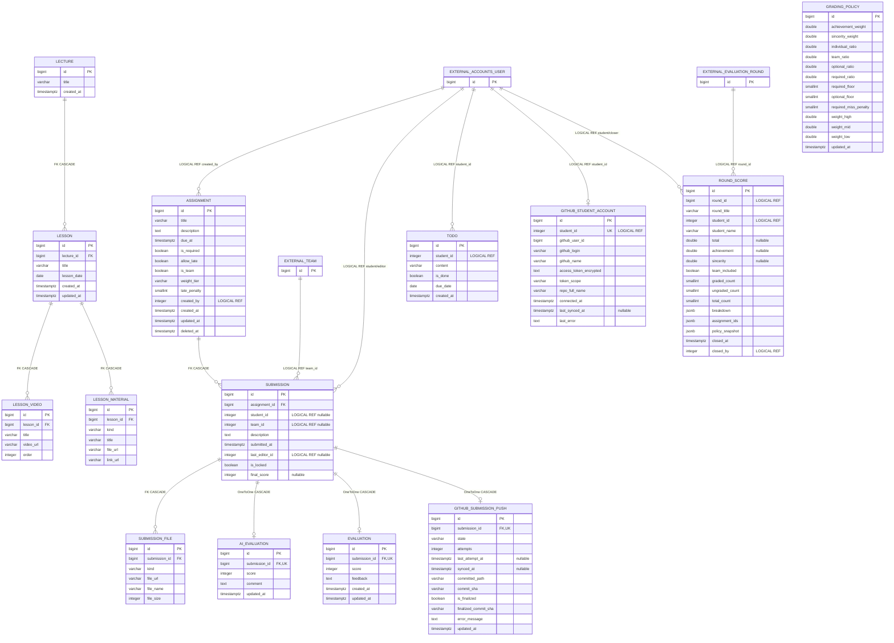

# Assignment LMS 데이터베이스 ERD 및 테이블 명세

- 기준일: 2026-09-02
- DBMS: PostgreSQL
- 기준 소스: 현재 Django 모델 및 실제 `default` DB introspection
- 이 문서의 소유 테이블 범위: Assignment LMS가 직접 생성·관리하는 14개 테이블

## 1. 전달 시 주의사항

이 프로젝트는 DB를 두 개 사용한다.

1. `default`: Assignment LMS 전용 DB. 아래 14개 업무 테이블을 직접 읽고 쓴다.
2. `accounts`: AX2 통합 플랫폼 DB. 계정·팀·회차 정보를 읽기 전용으로 사용한다.

`accounts_user.id`, `teams_team.id`, `rounds_evaluationround.id`를 저장하는 컬럼은 외부 DB를 가리키는 **논리 참조**다. 현재 DB가 분리되어 있으므로 PostgreSQL 물리 FK는 설정하지 않았다. 메인 프로젝트에 통합할 때도 DB 배치 방식이 확정되기 전까지 이 컬럼들에 FK를 임의로 추가하면 안 된다.

## 2. 테이블 개수

| 구분 | 개수 | 비고 |
|---|---:|---|
| Assignment LMS 업무 테이블 | 14 | 이 문서와 DBML의 대상 |
| Django 기본 테이블 | 10 | auth, admin, session, migration 등 |
| `default` DB 실제 테이블 | 24 | 2026-09-02 로컬 접속 결과 |
| 외부 DB에서 매핑해 사용하는 객체 | 4 | 테이블 2개, VIEW 2개 |

업무 테이블 14개는 `core` 10개, `tutor` 2개, `github_sync` 2개로 구성된다.

## 3. 전체 ERD

실선 관계는 현재 DB에 설정된 물리 FK다. `LOGICAL REF`로 표시한 외부 관계는 ID만 저장하며 물리 FK가 아니다.



## 4. 테이블별 상세 설명

### 4.1 `lecture`

전체 교육 과정을 나타낸다. 현재 서비스는 단일 강의 운영 규칙을 사용하므로 애플리케이션에서 가장 작은 `id`의 한 행을 계속 사용한다.

| 컬럼 | 타입 | NULL | 설명 |
|---|---|---|---|
| `id` | bigint | N | PK, 자동 증가 |
| `title` | varchar(200) | N | 강의 과정명 |
| `created_at` | timestamptz | N | 생성 시각 |

### 4.2 `lesson`

날짜별 강의 차시다. 한 강의에 여러 차시가 들어가며 차시 삭제 시 영상과 교안도 함께 삭제된다.

| 컬럼 | 타입 | NULL | 설명 |
|---|---|---|---|
| `id` | bigint | N | PK |
| `lecture_id` | bigint | N | FK → `lecture.id`, ON DELETE CASCADE |
| `title` | varchar(200) | N | 차시 제목 |
| `lesson_date` | date | N | 수업 날짜 |
| `created_at` | timestamptz | N | 생성 시각 |
| `updated_at` | timestamptz | N | 수정 시각 |

### 4.3 `lesson_video`

차시에서 보여줄 유튜브 등의 다시보기 영상이다. 차시 하나에 여러 영상을 등록할 수 있다.

| 컬럼 | 타입 | NULL | 설명 |
|---|---|---|---|
| `id` | bigint | N | PK |
| `lesson_id` | bigint | N | FK → `lesson.id`, ON DELETE CASCADE |
| `title` | varchar(200) | N | 영상 제목, 빈 문자열 허용 |
| `video_url` | varchar(200) | N | 영상 URL |
| `order` | integer | N | 영상 노출 순서, 기본값 0 |

정렬 기준은 `order`, `id` 오름차순이다.

### 4.4 `lesson_material`

차시별 수업 교안 또는 실습 자료다. 업로드 파일과 외부 링크를 모두 지원한다.

| 컬럼 | 타입 | NULL | 설명 |
|---|---|---|---|
| `id` | bigint | N | PK |
| `lesson_id` | bigint | N | FK → `lesson.id`, ON DELETE CASCADE |
| `kind` | varchar(10) | N | `FILE` 또는 `LINK` |
| `title` | varchar(200) | N | 자료명 |
| `file_url` | varchar(200) | Y | 파일 자료 경로 |
| `link_url` | varchar(200) | Y | 외부 자료 URL |

`kind=FILE`이면 `file_url`, `kind=LINK`이면 `link_url`을 사용한다.

### 4.5 `assignment`

튜터가 등록한 개인 또는 팀 과제다. 필수 여부, 지각 제출, 성적 가중치와 소프트 삭제를 지원한다.

| 컬럼 | 타입 | NULL | 설명 |
|---|---|---|---|
| `id` | bigint | N | PK |
| `title` | varchar(200) | N | 과제명 |
| `description` | text | N | 과제 안내 |
| `due_at` | timestamptz | N | 제출 마감 시각 |
| `is_required` | boolean | N | 필수 과제 여부, 기본값 true |
| `allow_late` | boolean | N | 지각 제출 허용 여부, 기본값 true |
| `is_team` | boolean | N | true=팀 과제, false=개인 과제 |
| `weight_tier` | varchar(10) | N | 중요도 `HIGH`, `MID`, `LOW` |
| `late_penalty` | smallint | N | 지각 제출 고정 감점, 기본값 0 |
| `created_by` | integer | N | 논리 참조 → 외부 `accounts_user.id` |
| `created_at` | timestamptz | N | 생성 시각 |
| `updated_at` | timestamptz | N | 수정 시각 |
| `deleted_at` | timestamptz | Y | NULL=활성, 값 존재=소프트 삭제 |

삭제 동작은 실제 DELETE가 아니라 `deleted_at` 기록이며 복구할 수 있다.

### 4.6 `submission`

학생 또는 팀의 과제 제출 행이다. 재제출은 제출 이력을 추가하지 않고 기존 제출물과 첨부자료를 갱신한다.

| 컬럼 | 타입 | NULL | 설명 |
|---|---|---|---|
| `id` | bigint | N | PK |
| `assignment_id` | bigint | N | FK → `assignment.id`, ON DELETE CASCADE |
| `student_id` | integer | Y | 개인 과제 제출자, 논리 참조 → 외부 `accounts_user.id` |
| `team_id` | integer | Y | 팀 과제 제출팀, 논리 참조 → 외부 `teams_team.id` |
| `description` | text | N | 제출 설명 |
| `submitted_at` | timestamptz | N | 최초 제출 시각 |
| `last_editor_id` | integer | Y | 마지막 제출·수정 사용자, 외부 `accounts_user.id` |
| `is_locked` | boolean | N | 평가 후 재제출 잠금 여부 |
| `final_score` | integer | Y | 튜터 평가 점수 캐시 |

DB CHECK `submission_student_id_xor_team_id`가 적용되어 `student_id`와 `team_id` 중 정확히 하나만 값이 있어야 한다.

### 4.7 `submission_file`

제출물에 포함된 복수 파일 또는 복수 링크를 저장한다. 링크 제출도 별도 테이블이 아니라 이 테이블을 사용한다.

| 컬럼 | 타입 | NULL | 설명 |
|---|---|---|---|
| `id` | bigint | N | PK |
| `submission_id` | bigint | N | FK → `submission.id`, ON DELETE CASCADE |
| `kind` | varchar(10) | N | `PY`, `IPYNB`, `OTHER` |
| `file_url` | varchar(200) | N | 저장 파일 URL 또는 사용자가 제출한 링크 |
| `file_name` | varchar(255) | N | 원본 파일명 또는 링크 표시명 |
| `file_size` | integer | N | byte 단위, 링크는 0 |

### 4.8 `ai_evaluation`

제출물의 AI 1차 평가 결과다. 제출물당 최대 한 행이며 재생성할 때 기존 결과를 갱신한다.

| 컬럼 | 타입 | NULL | 설명 |
|---|---|---|---|
| `id` | bigint | N | PK |
| `submission_id` | bigint | N | UNIQUE FK → `submission.id`, ON DELETE CASCADE |
| `score` | integer | N | AI 점수, 업무 범위 0~100 |
| `comment` | text | N | AI 평가 코멘트 |
| `updated_at` | timestamptz | N | 마지막 평가 시각 |

### 4.9 `evaluation`

튜터가 저장하는 공식 평가다. 제출물당 최대 한 행이고, 저장하면 `submission.final_score`가 동기화되며 제출물이 잠긴다.

| 컬럼 | 타입 | NULL | 설명 |
|---|---|---|---|
| `id` | bigint | N | PK |
| `submission_id` | bigint | N | UNIQUE FK → `submission.id`, ON DELETE CASCADE |
| `score` | integer | N | 튜터 점수, 업무 범위 0~100 |
| `feedback` | text | N | 튜터 피드백 |
| `created_at` | timestamptz | N | 최초 평가 시각 |
| `updated_at` | timestamptz | N | 수정 시각 |

### 4.10 `todo`

학생 대시보드의 날짜별 개인 할 일이다.

| 컬럼 | 타입 | NULL | 설명 |
|---|---|---|---|
| `id` | bigint | N | PK |
| `student_id` | integer | N | 논리 참조 → 외부 `accounts_user.id` |
| `content` | varchar(500) | N | 할 일 내용 |
| `is_done` | boolean | N | 완료 여부, 기본값 false |
| `due_date` | date | N | 달력 배치 날짜 |
| `created_at` | timestamptz | N | 생성 시각 |

인덱스: `todo_student_due_idx(student_id, due_date)`.

### 4.11 `grading_policy`

성적 계산에 사용하는 비중, 최저 보장점수, 미제출 점수와 중요도 배수를 관리한다. 애플리케이션에서는 가장 작은 `id`의 한 행을 싱글턴으로 사용한다.

| 컬럼 | 타입 | 기본값 | 설명 |
|---|---|---:|---|
| `id` | bigint | 자동 증가 | PK |
| `achievement_weight` | double precision | 0.70 | 과제 성취도 비중 |
| `sincerity_weight` | double precision | 0.30 | 제출 성실성 비중 |
| `individual_ratio` | double precision | 0.70 | 성취도 내 개인 과제 비중 |
| `team_ratio` | double precision | 0.30 | 성취도 내 팀 과제 비중 |
| `optional_ratio` | double precision | 0.60 | 성취도 내 선택 과제 비중 |
| `required_ratio` | double precision | 0.40 | 성취도 내 필수 과제 비중 |
| `required_floor` | smallint | 40 | 필수 과제 제출 최저 보장점수 |
| `optional_floor` | smallint | 20 | 선택 과제 제출 최저 보장점수 |
| `required_miss_penalty` | smallint | 10 | 필수 과제 미제출 시 부여 점수 |
| `weight_high` | double precision | 1.5 | 중요도 상 배수 |
| `weight_mid` | double precision | 1.0 | 중요도 중 배수 |
| `weight_low` | double precision | 0.5 | 중요도 하 배수 |
| `updated_at` | timestamptz | 자동 | 수정 시각 |

### 4.12 `round_score`

회차 점수 마감 시점의 학생별 결과와 계산 정책을 보존하는 스냅샷이다. 재마감하면 같은 회차·학생 조합의 행을 갱신한다.

| 컬럼 | 타입 | NULL | 설명 |
|---|---|---|---|
| `id` | bigint | N | PK |
| `round_id` | bigint | N | 논리 참조 → 외부 `rounds_evaluationround.id` |
| `round_title` | varchar(200) | N | 회차명 스냅샷 |
| `student_id` | integer | N | 논리 참조 → 외부 `accounts_user.id` |
| `student_name` | varchar(150) | N | 학생명 스냅샷 |
| `total` | double precision | Y | 최종 점수, 산출 불가 시 NULL |
| `achievement` | double precision | Y | 성취도 점수 |
| `sincerity` | double precision | Y | 성실성 점수 |
| `team_included` | boolean | N | 팀 과제 반영 여부 |
| `graded_count` | smallint | N | 채점 완료 과제 수 |
| `ungraded_count` | smallint | N | 미채점 과제 수 |
| `total_count` | smallint | N | 집계 대상 과제 수 |
| `breakdown` | jsonb | N | 영역별 상세 계산 결과 |
| `assignment_ids` | jsonb | N | 집계 대상 과제 ID 배열 |
| `policy_snapshot` | jsonb | N | 마감 당시 성적 정책 |
| `closed_at` | timestamptz | N | 마감 또는 재마감 시각 |
| `closed_by` | integer | N | 마감 튜터, 외부 `accounts_user.id` |

제약조건: UNIQUE `round_score_round_student_uniq(round_id, student_id)`.

인덱스: `round_score_round_idx(round_id)`.

### 4.13 `github_student_account`

학생의 GitHub OAuth 연결과 제출 저장소 정보를 저장한다. 학생당 최대 한 행이다.

| 컬럼 | 타입 | NULL | 설명 |
|---|---|---|---|
| `id` | bigint | N | PK |
| `student_id` | integer | N | UNIQUE, 외부 `accounts_user.id` 논리 참조 |
| `github_user_id` | bigint | N | GitHub 사용자 ID |
| `github_login` | varchar(100) | N | GitHub 로그인명 |
| `github_name` | varchar(200) | N | GitHub 표시 이름 |
| `access_token_encrypted` | text | N | Fernet 암호화 액세스 토큰 |
| `token_scope` | varchar(200) | N | OAuth 권한 범위 |
| `repo_full_name` | varchar(200) | N | `owner/repository` 형식 저장소명 |
| `connected_at` | timestamptz | N | 최초 연결 시각 |
| `last_synced_at` | timestamptz | Y | 마지막 동기화 시각 |
| `last_error` | text | N | 마지막 오류 메시지 |

### 4.14 `github_submission_push`

제출물의 GitHub push 진행 상태와 커밋 결과를 저장한다. 제출물당 최대 한 행이다.

| 컬럼 | 타입 | NULL | 설명 |
|---|---|---|---|
| `id` | bigint | N | PK |
| `submission_id` | bigint | N | UNIQUE FK → `submission.id`, ON DELETE CASCADE |
| `state` | varchar(12) | N | `PENDING`, `SYNCED`, `FAILED`, `NO_ACCOUNT` |
| `attempts` | integer | N | 동기화 시도 횟수 |
| `last_attempt_at` | timestamptz | Y | 마지막 시도 시각 |
| `synced_at` | timestamptz | Y | 동기화 성공 시각 |
| `committed_path` | varchar(500) | N | 저장소에 커밋한 경로 |
| `commit_sha` | varchar(64) | N | 동기화 커밋 SHA |
| `is_finalized` | boolean | N | 최종 제출 커밋 완료 여부 |
| `finalized_commit_sha` | varchar(64) | N | 최종 제출 커밋 SHA |
| `error_message` | text | N | 실패 내용 |
| `updated_at` | timestamptz | N | 상태 수정 시각 |

인덱스: `github_subm_state_9814de_idx(state)`.

## 5. 외부 DB 참조 명세

아래 객체는 Assignment LMS 소유 테이블이 아니며, `accounts` DB에서 읽기 전용으로 사용한다.

| 외부 객체 | 종류 | 사용 목적 |
|---|---|---|
| `accounts_user` | TABLE | 로그인 인증 및 사용자 ID 참조 |
| `rounds_evaluationround` | TABLE | 평가 회차 기간과 상태 조회 |
| `ax_user_team_login_view` | VIEW | 로그인 사용자 역할과 최신 팀 조회 |
| `user_round_team_view` | VIEW | 회차별 학생·팀 소속 조회 |

우리 테이블에서 외부 ID를 저장하는 위치:

| 우리 컬럼 | 외부 대상 |
|---|---|
| `assignment.created_by` | `accounts_user.id` |
| `submission.student_id` | `accounts_user.id` |
| `submission.team_id` | `teams_team.id` |
| `submission.last_editor_id` | `accounts_user.id` |
| `todo.student_id` | `accounts_user.id` |
| `round_score.round_id` | `rounds_evaluationround.id` |
| `round_score.student_id` | `accounts_user.id` |
| `round_score.closed_by` | `accounts_user.id` |
| `github_student_account.student_id` | `accounts_user.id` |

## 6. 물리 FK 및 삭제 정책

| 자식 컬럼 | 부모 컬럼 | 관계 | 삭제 정책 |
|---|---|---|---|
| `lesson.lecture_id` | `lecture.id` | N:1 | CASCADE |
| `lesson_video.lesson_id` | `lesson.id` | N:1 | CASCADE |
| `lesson_material.lesson_id` | `lesson.id` | N:1 | CASCADE |
| `submission.assignment_id` | `assignment.id` | N:1 | CASCADE |
| `submission_file.submission_id` | `submission.id` | N:1 | CASCADE |
| `ai_evaluation.submission_id` | `submission.id` | 0..1:1 | CASCADE |
| `evaluation.submission_id` | `submission.id` | 0..1:1 | CASCADE |
| `github_submission_push.submission_id` | `submission.id` | 0..1:1 | CASCADE |

단, 일반적인 과제 삭제는 `assignment` 행의 실제 삭제가 아니라 `deleted_at`을 사용하는 소프트 삭제다. 따라서 정상 UI 흐름에서는 제출물이 연쇄 삭제되지 않는다.

## 7. Django 기본 테이블

메인 DB 병합 시 업무 테이블과 중복 집계하지 않도록 별도로 구분한다.

```text
auth_group
auth_group_permissions
auth_permission
auth_user
auth_user_groups
auth_user_user_permissions
django_admin_log
django_content_type
django_migrations
django_session
```

## 8. 전달 파일

- `assignment_lms_erd.md`: 설명, Mermaid ERD, 컬럼 및 제약조건 명세
- `assignment_lms_erd.dbml`: dbdiagram.io 등 DBML 지원 도구에 바로 import 가능한 ERD 원본

